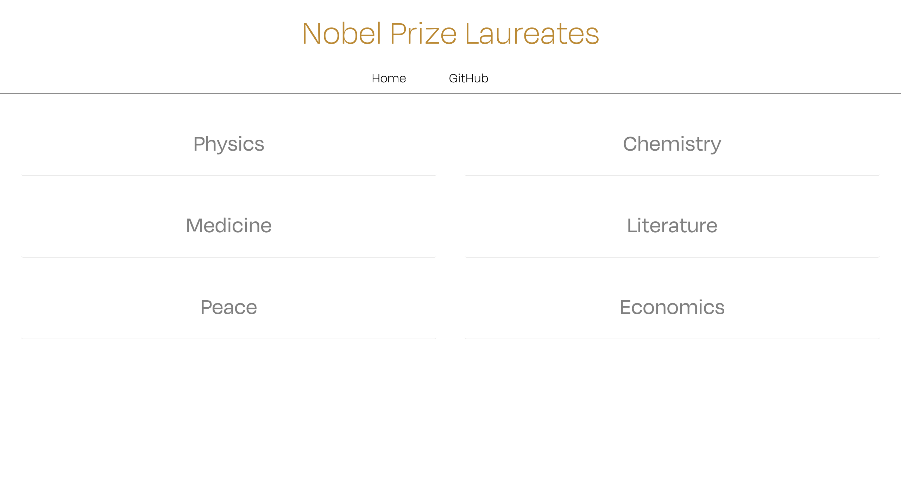
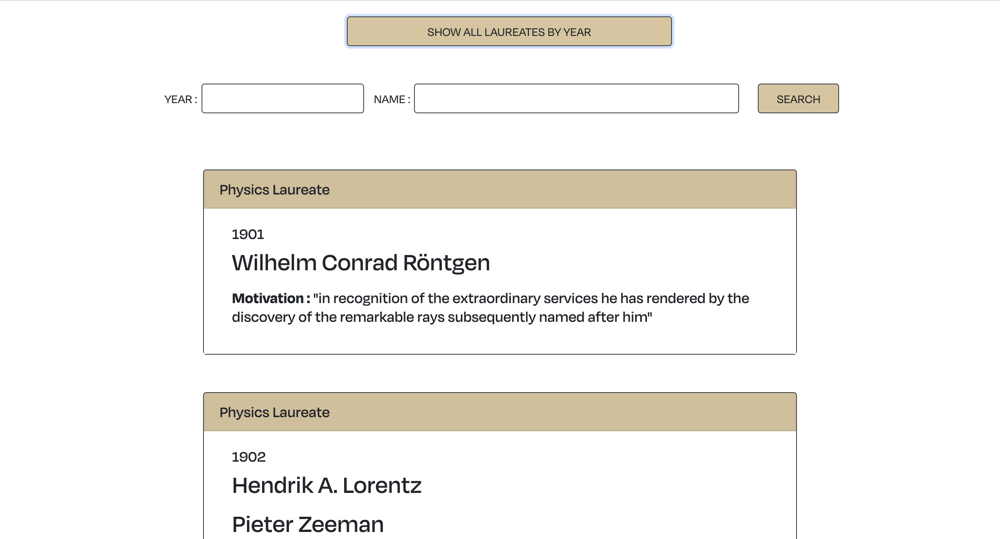
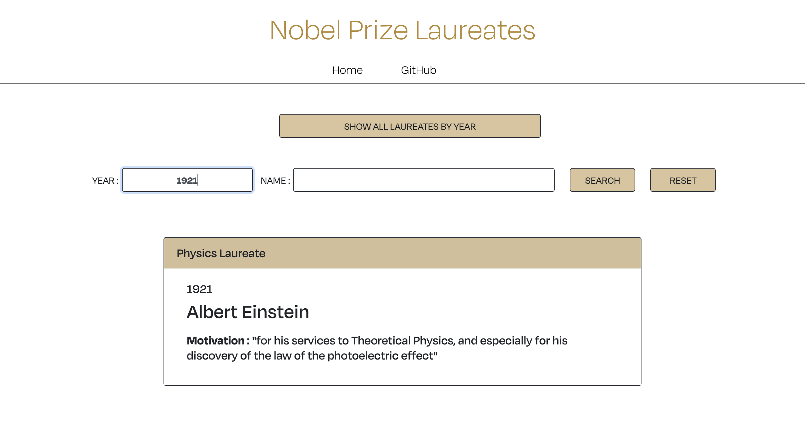

# Nobel App

The Nobel app uses two open endpoints about the Nobel Prizes and the Nobel Laureates from Nobelprize.org website.
The goal was to use React to retrieve and display the data with a personal UI and Design using styling frameworks such as Radium or Module.css

The home page allows the user to select the category of its choice :

On the category page, the user can display all the laureates using one endpoint (all the laureates for each year on the same card) with the button "SHOW ALL LAUREATES BY YEAR":

Or can search by Year or by Name using another endpoint displaying each laureate on a single card with the "SEARCH" button :

