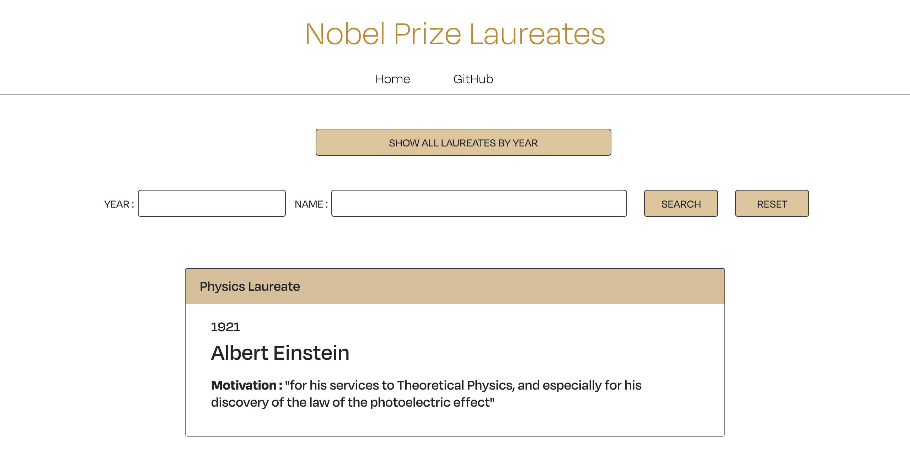

This app makes use of two open endpoints about the Nobel Prizes and the Nobel Laureates
from Nobelprize.org website. 
My goal was to use React to retrieve and display the data with a personal design using Radium and module.css files.

The home page allows users to select the category of their choice:

On the category page, the user has the choice to display all the laureates using one endpoint or do a search by Year or by Name using another endpoint:

