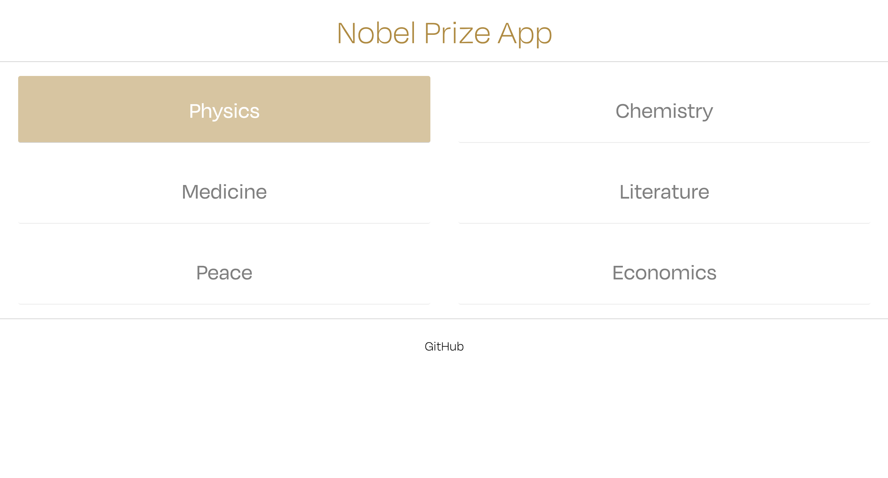

# NobelPrize App

This app uses two open endpoints to retrieve data from the API of Nobelprize.org. 
Using React, data was retrieved and displayed with a customized UI design and deployed with Heroku.

Please try the app by visiting the link: https://nobeldeploy2.herokuapp.com/

### Tools: React, REST API, CSS Modules, Radium, Adobe Typekit, Heroku

The home page allows the user to select the category of their choosing :

#
On the category page, the user can display all the laureates with the button "SHOW ALL LAUREATES BY YEAR":

#
Or can search by Year or by Name displaying each laureate on a single card with the "SEARCH" button :

