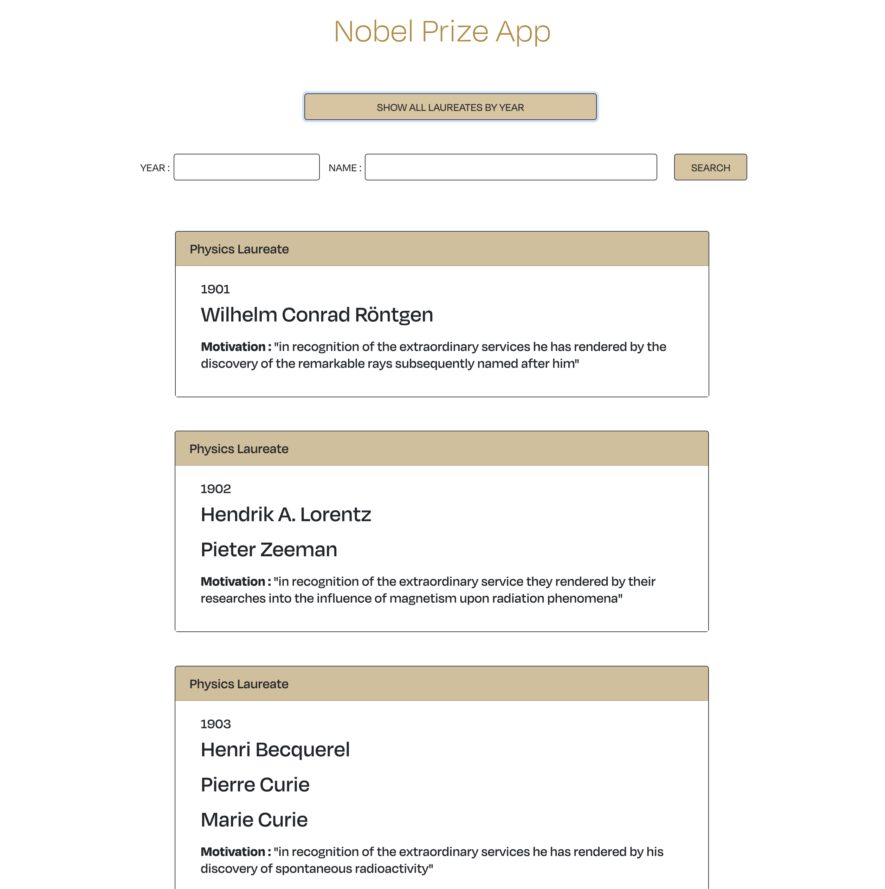

# Nobel App

### React, REST API, modules.css, Radium, Adobe Typekit, Heroku
This app uses two open endpoints to retrieve data from the API of Nobelprize.org 
Using React, data was retrieved and displayed with a customized UI design with frameworks such as Module.css and deployed with Heroku.

The home page allows the user to select the category of its choice :

#
On the category page, the user can display all the laureates with the button "SHOW ALL LAUREATES BY YEAR":

#
Or can search by Year or by Name  displaying each laureate on a single card with the "SEARCH" button :

